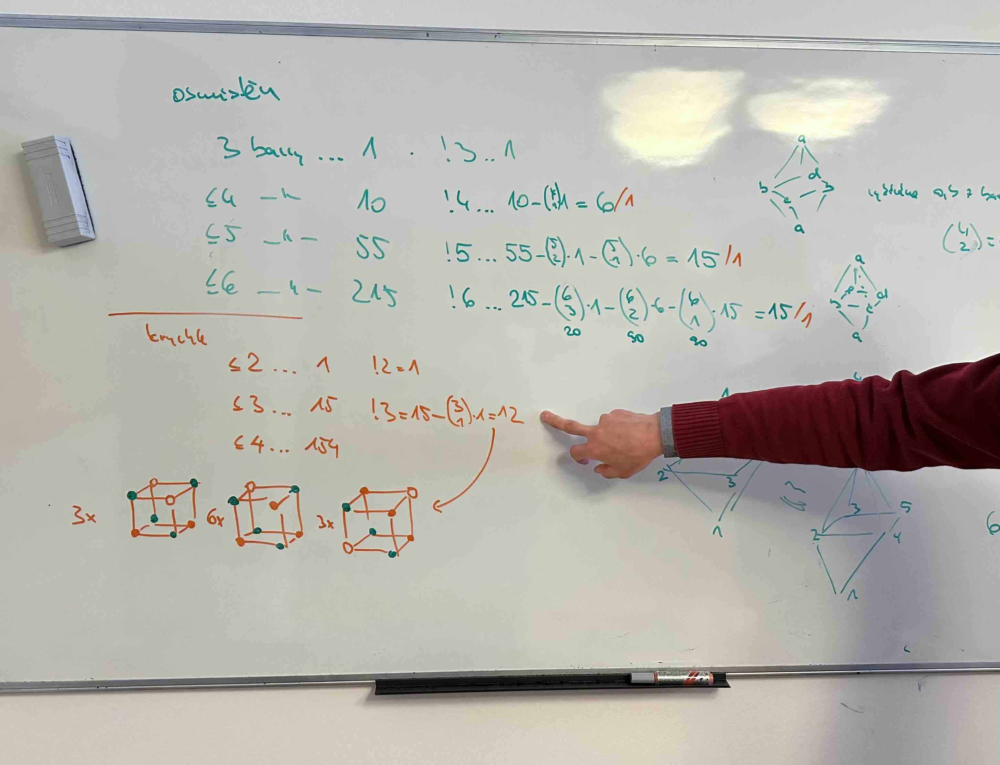

# Meeting 7.4.2025

## Questions

- Would like to have finished version in two weeks till 21st April. What should else do I need to add to the thesis to finalize it?

- Rainbow coloring and magic labeling - should I keep their defns in the thesis?

- How to finish the proof of the orbital chromatic polynomial formula?
  - How to limit degree of OP? Do I need to limit the degree at all? (it is enough that it has some finite degree)

- Is the example of the ocahedral colorings of octahedral graph what he expected?
  - should I add another or different example?

## Updates

- show the computed values in desmos for selected solids
  - [link](https://www.desmos.com/calculator/km00smjmey)

## Notes 

- for colorings like magic labeling etc. mention them in the conclusion that we wanted to show what we will be doing in contrast of the other possibilites that we would have with other colorings
  - mention, that it would be an interesting problem to solve the problem about symmetries for the other colorings as well (we would have to somehow be able to convert between them maybe)

## TODOs 

- add computed desmos tables for Platonic solids to the thesis
  - comment that it gives coloring with at most n colors and not exactly n colors
    - how to calculate colorings with exactly n colors?

- see 

- show on cube, what the colorings with using exactly n colors are

- label what the arrows in the figure for octahedron recurrency correspond to